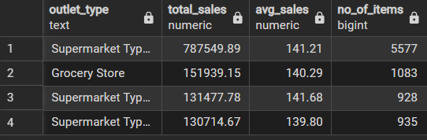

# Grocery_Retail_Sales_Analysis
"End-to-end Retail Sales Analysis using SQL + Power BI"

This project presents an interactive Power BI dashboard designed to analyze retail sales performance across multiple dimensions such as product categories, outlet types, and locations. It provides key insights into total sales, average sales, item distribution, and customer ratings, enabling data-driven decision-making.

🔷 Project Title UrbanCart Retail Sales Analytics Dashboard (Power BI + SQL)

## 📊 Dashboard Preview

## 📂 Power BI File

You can download the Power BI template file here:  
👉 [Download Dashboard](retail_dashboard.pbit)

⚠️ Note: The dataset is not included. Please connect your own dataset when opening the .pbit file.

🧩 Problem

Retail businesses often struggle to track and analyze large volumes of sales data across different product categories, outlet types, and locations. Without a centralized dashboard, it becomes difficult to identify sales trends, monitor performance, and make data-driven decisions.

💡 Solution

Developed an interactive Power BI dashboard to analyze grocery retail sales data. The dashboard consolidates key metrics such as total sales, average sales, number of items, and customer ratings. It provides detailed insights by product category, outlet size, outlet type, and location using dynamic filters and visualizations.

🛠️ Tools & Technologies

Power BI SQL (for data querying & transformations) Excel (data cleaning & preprocessing)

📊 Output

Interactive dashboard with key KPIs: Total Sales Average Sales Number of Items Average Rating

--> Visual breakdown by:

Product categories Outlet type and size Location-based analysis User-friendly filters and slicers for dynamic insights

## 🧮 SQL Queries

- Used SQL for data extraction and transformation  
- Applied aggregations (SUM, AVG, COUNT) to calculate KPIs  
- Performed grouping by outlet type, item type, and location  
- Created queries for sales trends and percentage contribution  

📈 Business Impact

Enabled quick identification of high-performing products and outlets Helped in analyzing customer preferences and sales trends Supported data-driven decision-making for inventory and sales strategy Improved visibility into overall business performance through a single dashboard

⚠️ Note: Dataset is not shared publicly. A template/dashboard preview is provided for demonstration purposes.

